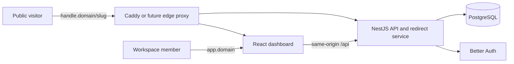

# Architecture overview

## Context

## Components

- `apps/web`: React and Vite dashboard. It uses the vendored Tablón design-system tokens.
- `apps/api`: NestJS on Express. Better Auth is mounted at `/api/auth/*` before Nest
  JSON parsing, based on the compatibility spike.
- `packages/contracts`: shared API shape and role types.
- `packages/design-system`: pinned CSS token copy from `LBTWorks/DesignSystem`.
- PostgreSQL: Better Auth, workspace membership, future links, and aggregate analytics data.
- Caddy: local host router. `app.localhost` routes dashboard and `/api`; other hosts route
  only to the API redirect surface.

## Data and consistency

Better Auth's Organization represents a workspace. Link records carry `organizationId`,
with composite uniqueness on `organizationId, slug`. Request guards must establish the
active member and role from the authenticated session and membership record. Database
queries never trust an organization identifier supplied by a browser.

Raw IP addresses and raw user-agent strings are excluded from analytics storage. The future
redirect pipeline derives a keyed daily visitor identifier, discards it within 24 hours,
and retains only required aggregates for 12 months.

## Integrations and public contracts

The dashboard and API share the trusted `app.<domain>` origin. Better Auth session cookies
remain host-only. Public workspace hosts are redirect-only and must never receive dashboard
session cookies. The application API is internal REST JSON in v1, with no public third-party
API commitment.

## Infrastructure and deployment

The repository ships portable Dockerfiles and Compose for API, dashboard, PostgreSQL, and
edge routing. Production provider selection, managed PostgreSQL, image registry, TLS,
backups, and DNS are deferred. A future US East deployment should preserve the current
hostname and cookie model.

## Security and privacy

Better Auth uses email/password with no verification or delivery integration in v1, static
workspace roles, trusted origins, and its in-memory rate limiter for the single-instance demo.
No CAPTCHA is planned for the demo scope. A shared rate limiter is required before a
multi-instance production deployment. See the threat model for compensating quotas and
residual bot risk.

## Operations and failure recovery

Health and readiness probes are scaffolded. Redirect logs must use request IDs and avoid
destination query values, session values, raw IPs, and raw user agents. Redirect availability
takes priority over telemetry persistence.

## Approved constraints

- NestJS owns the backend. The frontend is React and Vite, not a Next.js backend.
- Prisma is the ORM.
- Better Auth provides authentication and organization membership.
- Production is intentionally not provisioned in this change.

## Links to ADRs

- [ADR-0001](../decisions/ADR-0001-monorepo-and-runtime.md)
- [ADR-0002](../decisions/ADR-0002-workspace-tenancy.md)
- [ADR-0003](../decisions/ADR-0003-privacy-and-redirects.md)
